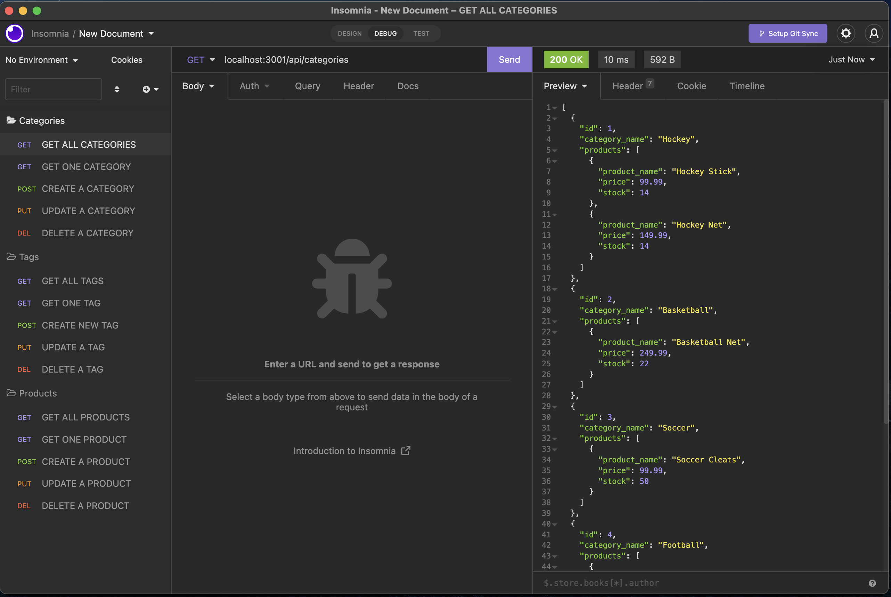
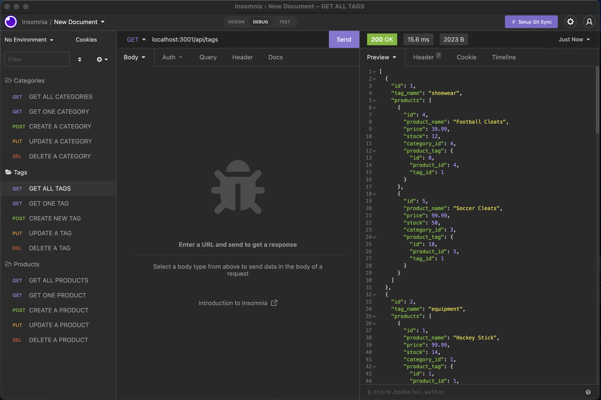
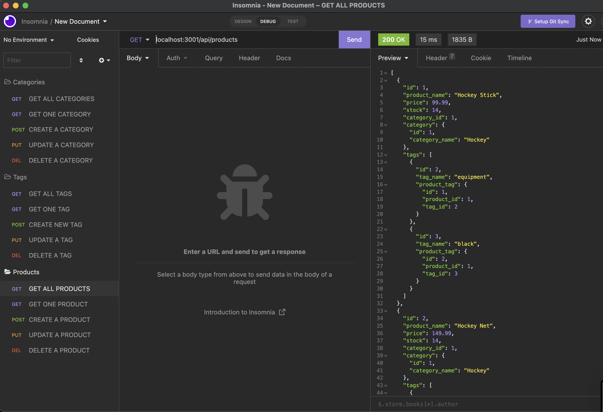

# All Sports Sporting Goods

  

## <u>Table of Contents</u>
1. [Description](#description)
2. [Installation](#installation)
3. [Usage](#usage)
4. [Contributing](#contributing)
5. [Questions](#questions)
6. [License](#license)

## Description
***

All Sports Sporting Goods is a Node.js CLI application that utilizes express to create a server with endpoints set up to access and perform CRUD methods to a sporting goods e-commerce MySQL database. 

This application utilizes Sequelize to easily create MySQL commands which allow the user to Create, Read, Update and Delete data from the database. Ths application requires the user to have a MySQL account so they can access the database. This application is purely backend and can be tested using Insomnia to view the API endpoints and perform the CRUD methods. 

## Installation
***

To install this application get the repository link from above, either via an HTTP or SSH link. 

```
git clone 
```

Once you have the repository cloned to your local machine, navigate to the root of the repository in your terminal.

```
npm install
```

This will install all the necessary dependencies that are needed for the application to run.

Then in the application's root directory, create a .env file. Within this file, enter the following lines, but with your MySQL username and password:
DB_NAME='All_Sports_Sporting_Goods'
DB_USER='MySQL_USERNAME'
DB_PW='MySQL_PASSWORD'
This will establish a connection to MySQL and allow you to create the database on your local machine and in your MySQL account. The rest of the connection is already set up and ready to use!


## Usage
***

To use this application, navigate to the root of this repository in the terminal and enter either of the following commands:

```
npm start || node server.js
```

This will initialize the node server and allow you to access the database. By following the API routes established in the project, you can perform CRUD for categories, products and tags. 

The following images show the application being used: 

 

***



***




***

The following is a link to a video which shows how the application is set up: [E-Commerce Backend Set Up Video](https://vimeo.com/707673457)

The following is a link to a video which shows the various API endpoints and features: [E-Commerce Backend Features Walkthrough Video](https://vimeo.com/707677363)


## Contributing
***

To contribute to this application, push any enhancements and changes you code and send an email to charanvir123@gmail.com. The developer will get back to you if they wish to implement any of the code changes you've made. 

## Questions
***
To view more projects visit my [Github](https://github.com/Charanvir) account.

Direct any additional questions you have regarding this application to charanvir123@gmail.com

## License
***
The following application is covered under the MIT License
